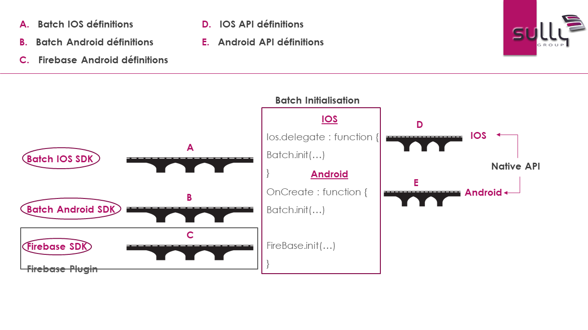

# Nativescript Batch plugin

Welcome to Batch's Nativescript Plugin!<br>
Batch is a fully fledged mobile engagement platform to execute CRM tactics over iOS, Android & mobile websites.<br>
The purpose of this plugin is to manage Push notifications, in-app messages and more.., for Android and IOS.<br>
This repository contains the plugin's source code and a demo application.

## Installation

NPM
```javascript
npm i nativescript-batch-notifications
```

## Prerequisites / Requirements

First of all, you must [create a batch account](https://batch.com/register#/);<br>
Then a configuration is required for each platform;<br>
This process is explained through simple steps in batch official documentation.<br>
 [IOS setup](https://batch.com/doc/android/prerequisites.html)<br>
 [Android setup](https://batch.com/doc/ios/prerequisites.html)<br>
 When you add your Firebase android project, download the google-services.json which you'll add to your NativeScript project at app/App_Resources/Android/google-services.json

For a quick start using the demo app :
- Override the bundle id in 'package.json' in the demo directory
- Override the API keys with the ones generated by your batch account in the 'app.ts' file (for IOS) and the 'application.android.ts' file (for Android).

## How it works

A picture is worth a thousand words


## Android initialization

We must override the OnCreate method.<br>
In order to do so, change the application name value in the AndroidManifest from com.tns.NativeScriptApplication to something like org.myApp.Application.<br>
Then, in the root dir, create a typescript file named : 'application.android.ts' and enter the bellow code.

    const firebase = require("nativescript-plugin-firebase");
    // @ts-ignore
    import { Batch } from 'nativescript-batch-notifications';

    @JavaProxy("org.myApp.Application")
    class Application extends android.app.Application {
        public onCreate(): void {
            super.onCreate();
            let batch = new Batch();
            batch.init('YOUR_BATCH_API_KEY');
            this.registerActivityLifecycleCallbacks(batch.activityLifeCycleHelper());
            firebase.init().catch(e => console.dir(e));
        }
    }

## IOS initialization

We must setup a custom delegate; Override the app.ts in the root dir with the bellow code:

    import * as app from "tns-core-modules/application";
    import {run as applicationRun} from "tns-core-modules/application";
    // @ts-ignore
    import { Batch } from 'nativescript-batch-notifications';

    if (app.ios) {
    class customDelegate extends UIResponder implements UIApplicationDelegate {
        public static ObjCProtocols = [UIApplicationDelegate];

        applicationDidFinishLaunchingWithOptions(application: UIApplication, launchOptions: NSDictionary<string, any>): boolean {
            console.log("IOS Entered");
            let batch = new Batch();
            batch.initIOS('YOUR_BATCH_API_KEY');
            return true;
        }
    }
    app.ios.delegate = customDelegate;
    applicationRun({ moduleName: "main-page" });
    } else {
    applicationRun({ moduleName: "app-root" });
    }

## Important notes !!

- (Android) In this plugin version we assume that the [nativescript firebase plugin](https://github.com/EddyVerbruggen/nativescript-plugin-firebase) is installed; This will be fixed in upcoming releases.
- (IOS) When generating the xcode project, you **MUST** toggle 'Push Notifications' in the capabilities tab.

## License

MIT
